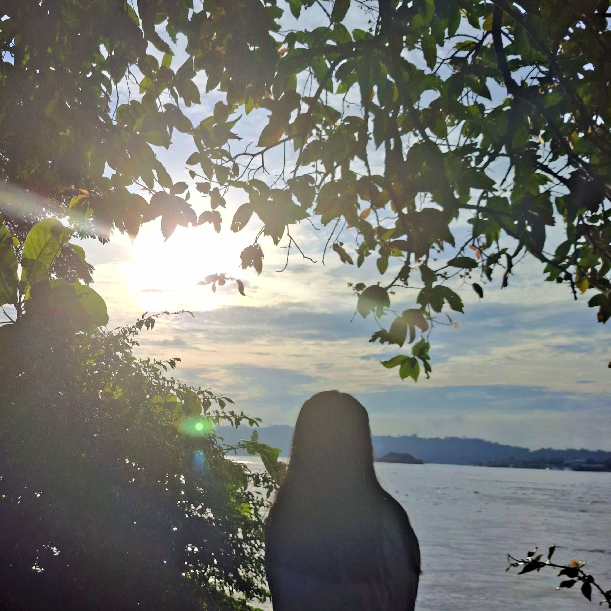

# 🎓 Portfolio Website — Marcela Persa Linthin

Website portofolio statis pribadi yang menampilkan profil, skill, pengalaman, dan sertifikat.

---

## 📁 Struktur File

```
portfolio/
│
├── index.html        # Halaman utama website
├── style.css         # File styling custom
├── README.md         # Dokumentasi proyek
└── image/
    ├── profil.jpg    
    ├── design.jpg    
    └── Excel.jpg     
```

---

## 🛠️ Teknologi yang Digunakan

| Teknologi | Keterangan |
|---|---|
| **HTML5** | Struktur dan konten halaman web |
| **CSS** | Styling custom, CSS Variables, layout |
| **Bootstrap 5.3** | Grid system, Navbar, Card, Progress Bar, Badge, Utilities |
| **Bootstrap Icons 1.11** | Ikon lokasi (`bi-geo-alt-fill`) pada Hero Section |
| **Google Fonts** | Font Cormorant Garamond (judul) & DM Sans (body) |

---

## 🖥️ Tampilan & Penjelasan Setiap Section

---

### 1. Navbar


**Tampilan:**
Navigasi tetap (sticky) di bagian atas halaman berwarna biru gelap. Berisi nama brand di kiri dan menu navigasi di kanan. Pada tampilan mobile, menu akan collapsed menjadi tombol hamburger.

**Penjelasan Code:**
```html
<nav class="navbar navbar-expand-lg navbar-dark sticky-top">
  <div class="container">
    <a class="navbar-brand fw-bold" href="#">Portfolio</a>
    <button class="navbar-toggler" type="button" data-bs-toggle="collapse" data-bs-target="#navMenu">
      <span class="navbar-toggler-icon"></span>
    </button>
    <div class="collapse navbar-collapse" id="navMenu">
      <ul class="navbar-nav ms-auto">
        <li class="nav-item"><a class="nav-link" href="#home">Home</a></li>
        <li class="nav-item"><a class="nav-link" href="#about">About Me</a></li>
        <li class="nav-item"><a class="nav-link" href="#certificates">Certificates</a></li>
      </ul>
    </div>
  </div>
</nav>
```

- `sticky-top` → navbar mengikuti scroll dan tetap di atas halaman
- `navbar-expand-lg` → menu tampil horizontal di layar besar, hamburger di layar kecil
- `data-bs-toggle="collapse"` → mengaktifkan efek buka/tutup menu di mobile
- `ms-auto` → mendorong menu ke sisi kanan
- CSS: warna navbar diatur via `.navbar { background-color: var(--blue-dark) }`

---

### 2. Home (Hero Section)


**Tampilan:**
Section penuh dengan background gradient biru, menampilkan foto profil bulat, nama, subtitle, lokasi, dan tombol "Lihat Selengkapnya".

**Penjelasan Code:**
```html
<section id="home" class="hero-section text-white text-center py-5">
  <div class="container py-5">
    
    <p class="hero-eyebrow">Welcome to my portfolio</p>
    <h1 class="hero-title">Marcela Persa Linthin</h1>
    <p class="hero-subtitle">Mahasiswa, UI/UX Designer &amp; Learner</p>
    <p class="hero-location mt-2">
      <i class="bi bi-geo-alt-fill me-1"></i> Samarinda, Indonesia
    </p>
    <a href="#about" class="btn btn-hero mt-4 px-4">Lihat Selengkapnya</a>
  </div>
</section>
```

- `.hero-section` → background gradient biru via `radial-gradient` di CSS
- `.profile-img` → foto dibuat bulat dengan `border-radius: 50%` dan border putih transparan
- `.hero-title` → menggunakan font Cormorant Garamond, ukuran responsif dengan `clamp()`
- `.hero-eyebrow` → teks kecil uppercase sebagai label pembuka
- `.btn-hero` → tombol putih dengan sudut rounded pill, hover naik sedikit

---

### 3. About Me


**Tampilan:**
Section putih dengan 3 sub-bagian: deskripsi diri (kiri), skill dengan progress bar (kanan), dan pengalaman dalam bentuk 3 kotak di bawahnya.

**Penjelasan Code:**

**a. Deskripsi Diri**
```html
<div class="col-md-5">
  <div class="card h-100 p-4">
    <h5 class="fw-semibold mb-2">Halo, saya Marcela Persa Linthin!</h5>
    <p class="text-muted">Saya mahasiswa yang bersemangat ...</p>
  </div>
</div>
```
- `col-md-5` → lebar 5 kolom pada layar medium ke atas
- `h-100` → tinggi card menyesuaikan kolom sebelah (skills)

**b. Skills (Progress Bar)**
```html
<div class="col-md-7">
  <div class="card h-100 p-4">
    <label class="form-label mb-1">Figma</label>
    <div class="progress mb-3">
      <div class="progress-bar" style="width: 70%">70%</div>
    </div>
    ...
  </div>
</div>
```
- `progress` → komponen Bootstrap untuk bar kemampuan
- `style="width: 60%"` → menentukan persentase skill langsung di inline style
- CSS custom mengubah warna bar menjadi gradient biru

**c. Pengalaman**
```html
<div class="col-12">
  <div class="card p-4">
    <h5 class="fw-semibold mb-3">Pengalaman</h5>
    <div class="row g-3">
      <div class="col-md-4">
        <div class="exp-item p-3 rounded">
          <span class="badge badge-exp mb-2">2025</span>
          <h6 class="fw-bold">Pencatatan Barang - Inventory</h6>
          <p class="text-muted small mb-0">Organisasi Kampus</p>
        </div>
      </div>
      ...
    </div>
  </div>
</div>
```
- `col-md-4` → 3 kolom pengalaman sejajar di layar medium ke atas, tumpuk di mobile
- `.exp-item` → box biru pucat dengan border sebagai latar item pengalaman
- `.badge` → label tahun berwarna biru menggunakan class custom `badge-exp`

---

### 4. Certificates


**Tampilan:**
Section biru pucat dengan 2 card sertifikat yang ditampilkan di tengah. Setiap card memiliki gambar sertifikat di bagian atas, judul, deskripsi singkat, dan keterangan issuer serta tanggal di bagian bawah.

**Penjelasan Code:**
```html
<section id="certificates" class="section-cert py-5">
  <div class="container">
    <h2 class="section-title mb-4">Certificates</h2>
    <div class="row g-4 justify-content-center">

      <div class="col-md-6 col-lg-4">
        <div class="card h-100">
          
          <div class="card-body">
            <h6 class="card-title fw-bold mb-1">Belajar Dasar UX Design</h6>
            <p class="card-text text-muted small mb-0">Mempelajari prinsip dasar UX dan design thinking.</p>
          </div>
          <div class="card-footer">
            <small class="text-muted">StudyClub — Okt 2025</small>
          </div>
        </div>
      </div>
      ...
    </div>
  </div>
</section>
```

- `justify-content-center` → card berada di tengah halaman
- `col-md-6 col-lg-4` → 2 kolom di layar medium, masing-masing 4/12 di layar besar
- `.cert-img` → gambar sertifikat di atas card dengan tinggi tetap dan `object-fit: cover`
- `card-footer` → bagian bawah card untuk informasi issuer dan tanggal

---

### 5. Footer


**Tampilan:**
Bar tipis di bagian paling bawah halaman, berwarna biru gelap dengan teks copyright di tengah.

**Penjelasan Code:**
```html
<footer class="site-footer text-white text-center py-3">
  <p class="mb-0 small">© 2024 Marcela Persa Linthin — Samarinda, Indonesia</p>
</footer>
```

- `text-center` → teks rata tengah
- `py-3` → padding atas bawah
- `.site-footer` → warna background disamakan dengan navbar `var(--blue-dark)`

---

## 🎨 Sistem Warna (CSS Variables)

Seluruh warna website dikelola melalui CSS Variables agar konsisten di semua section:

```css
:root {
  --blue-dark:  #0f2867;   
  --blue-main:  #4d7dc1;   
  --blue-mid:   #7aaedf;   
  --blue-light: #ddeeff;   
  --blue-pale:  #f0f6ff;   
  --white:      #ffffff;
  --text-dark:  #1a2a4a;
  --text-muted: #5a7a9a;
}
```

---

